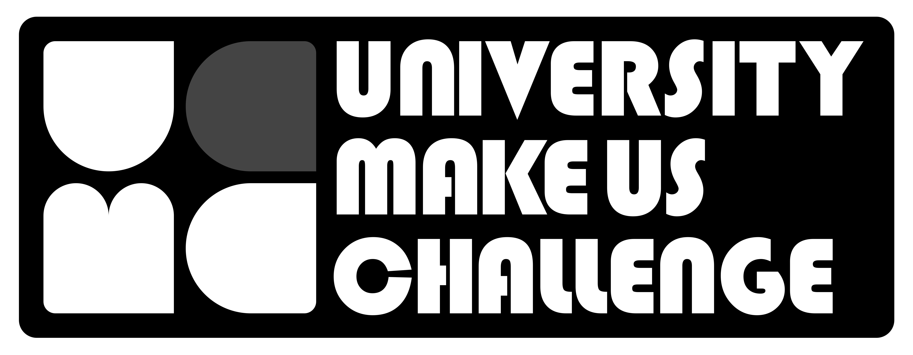

# University MakeUS Challenge Members

 
UMC는 Break the rules라는 슬로건을 가진 대학생 연합 동아리로서, 아웃소싱을 꿈꾸는 대학생들이 모여 함께 성장하는 <strong>Play Ground !</strong>
  

## 아래는 현재까지 운영된 기수 입니다
| 기수. |  학교 모아보기. | 
|---------|-------|
| 1st UMC | Univ  |
| 2nd UMC | Univ  | 
| 3rd UMC | [Univ](/3rd/Univ.md) | 

## 운영사무국 & 리더진

<!-- ALL-CONTRIBUTORS-LIST:START - Do not remove or modify this section -->
<!-- prettier-ignore-start -->
<!-- markdownlint-disable -->
<table>
  <tbody>
    <tr>
      <td align="center"><a href="https://sharechang.notion.site/s-Resume-ca6fb048b1ed47df86bda6161580afe5"> <b>박창현</b></a> <a href="#maintenance-Kid-Chang" title="Maintenance">🚧</a> <a href="https://github.com/University-MakeUs-Challenge/Member/commits?author=Kid-Chang" title="Code">💻</a></td>
    </tr>
  </tbody>
</table>

<!-- markdownlint-restore -->
<!-- prettier-ignore-end -->

<!-- ALL-CONTRIBUTORS-LIST:END -->
<!-- prettier-ignore-start -->
<!-- markdownlint-disable -->

<!-- markdownlint-restore -->
<!-- prettier-ignore-end -->

<!-- ALL-CONTRIBUTORS-LIST:END -->

<!-- ALL-CONTRIBUTORS-BADGE:START - Do not remove or modify this section -->

<!-- ALL-CONTRIBUTORS-BADGE:END -->
